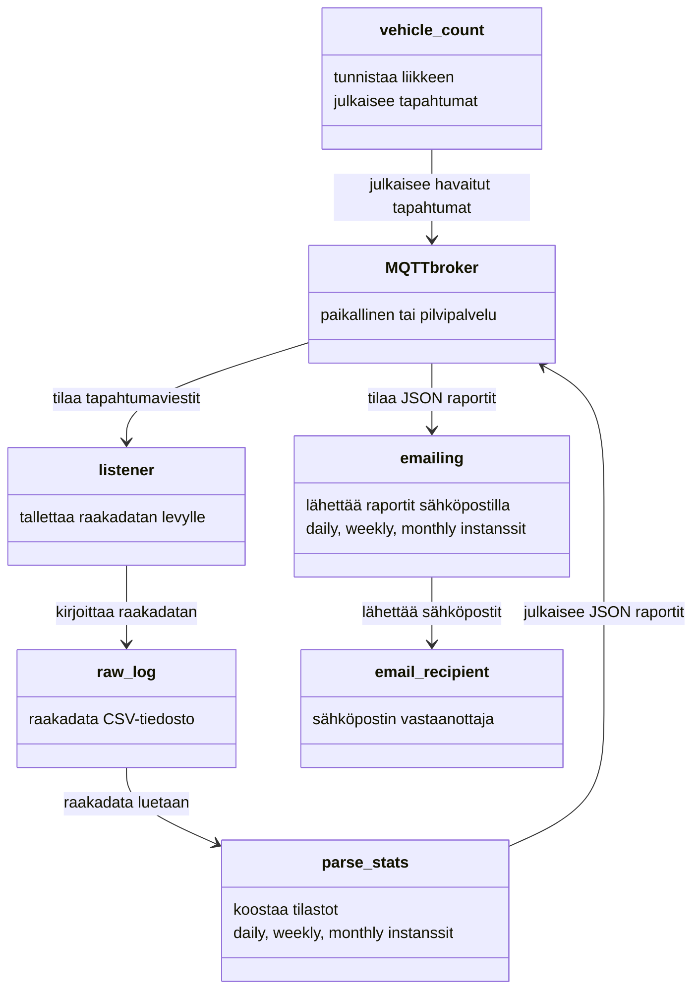
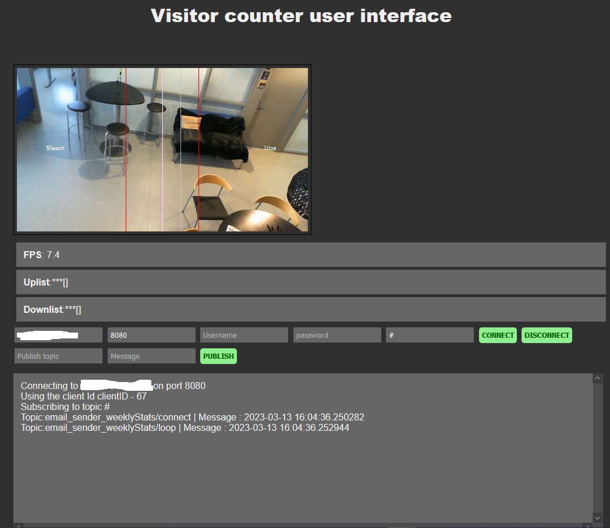

   
# Kävijäseuranta ja raportointi
Tämä sovellus laskee kamerakuvan perusteella kävijöiden määrät ja koostaa näistä raportit sähköpostiin päivittäin, viikottain ja kuukausittain.
# Julkaisun historiatiedot
Merkittävät muutokset julkaisuun

|pvm|Muutokset|Tekijä|
|---|---|---|
|15.2.2023|1. julkaisu|Tommi Ylimäki|
|13.3.2023|Mosquitto ja systemctl|Tommi Ylimäki|
|28.3.2023|julkaisu SeAMKedussa|Tommi Ylimäki|
# Sisällysluettelo
- [Julkaisun nimi](#julkaisun-nimi)
- [Julkaisun historiatiedot](#julkaisun-historiatiedot)
- [Sisällysluettelo](#sisällysluettelo)
- [Teknologiapilotti](#teknologiapilotti)
- [Hanketiedot](#hanketiedot)
- [Kuvaus](#kuvaus)
- [Tavoitteet](#tavoitteet)
- [Toimenpiteet](#toimenpiteet)
- [Asennus](#asennus)
- [Vaatimukset](#vaatimukset)
- [Käyttö/käynnistys](#käyttökäynnistys)
- [Tulokset](#tulokset)
- [Lisenssi](#lisenssi)
- [Tekijät](#tekijät)

# Teknologiapilotti
TehoData-hankkeen pilotissa 10 pyrittiin luomaan edullinen kävijälaskuri pienille matkailualan yrityksille Etelä-Pohjanmaalla. Julkaisu löytyy osoitteesta [https://lehti.seamk.fi/alykkaat-ja-energiatehokkaat-jarjestelmat/tekoaly-tuo-tarkkuutta-matkailuyrityksen-kavijadataan/](https://lehti.seamk.fi/alykkaat-ja-energiatehokkaat-jarjestelmat/tekoaly-tuo-tarkkuutta-matkailuyrityksen-kavijadataan/).

# Hanketiedot
- Hankkeen nimi: Datasta ketteryyttä ja uutta liiketoimintaa Etelä-Pohjanmaan pk-yrityksiin (TehoData)
- Rahoittaja: Keski-Suomen ELY/ Euroopan sosiaalirahasto ESR
- Aikataulu: 1.9.2021–31.08.2023
Hanke rahoitetaan REACT-EU-välineen määrärahoista osana unionin covid-19-pandemian johdosta toteuttamia toimia.
TehoDatan hankesivut löytyvät osoitteesta [https://projektit.seamk.fi/alykkaat-teknologiat/tehodata/](https://projektit.seamk.fi/alykkaat-teknologiat/tehodata/)

# Tavoitteet
Pilotissa kehitettiin edullista, avoimen lähdekoodin kuvantunnistusalgoritmien toimintaan perustuvaa kävijälaskuria.
# Toimenpiteet
Sovelluskokonaisuuden toimintaa on testattu pilottiyrityksessä kesällä 2023, minkä pohjalta määriteltiin jatkokehitystarpeet:
-sovellus on saatava toimimaan nopeammin (esimerkiksi Raspberry Pi 4:llä tai ainakin Jetson Nanolla)
-sovellukseen vaihdettiin paremmin toimiva kohteenseuranta-algoritmi
-sovellus on pilkottiin modulaarisiin osiin, jotta esimerkiksi tulo- ja lähtötapahtumien tunnistamiseen käytetty teknologia voidaan haluttaessa vaihtaa

# Kuvaus
Sovellus toteaa kamerakuvasta rajaviivat ylittäneet seurattavat kohteet ja koostaa näistä tiedoista raportit sähköpostiin päivittäin, viikottain ja kuukausittain.
## TIETOSUOJA JA TIETOTURVA
Sovellus käyttää suojaamatonta yhteyttä MQTT brokerin ja skriptien ja toisaalta http-palvelimen kanssa. Ethän käytä sovellusta kuin suljetussa lähiverkossa. 

Sovellus ei talleta kuvia tai videota, mutta se mahdollistaa kerran sekunnissa päivittyvän live-kuvan seuraamisen web-käyttöliittymän kautta. Tätä käyttöliittymää ei ole tarkoitus käyttää kuin asennusvaiheessa kameran oikean suuntaamisen varmistamiseksi.
## Kävijälaskurin toiminta
Kävijälaskurin toiminta perustuu modulaariseen sovellusrakenteeseen, joka koostuu viidestä päämoduulista:
- Tunnistusmoduuli [yoloCount.py](yoloCount.py) 
- edelliselle vaihtoehtoinen kasvojen tunnistamiseen pohjautuva [faceCount.py](faceCount.py)
- Dataa levylle tallettava [listener.py](listener.py)
- Tilastot muotoileva [parse_stats.py](parse_stats.py)
- Raportit sähköpostiin lähettävä [emailing.py](emailing.py)
- web-serverin käynnistävä [routes.py](routes.py)
- kaikkien Python-skriptien yhteinen konfiguraatiotiedosto [configuration.ini](configuration.ini) 
- edellisen mallipohjatiedosto [configuration.ini_model](configuration.ini_model)

Näiden lisäksi on apumoduuleja, joihin on pakattu tarvittavia funktioita ja luokkia:
- MQTT-moduulin käärivä [mqtt_class.py](mqtt_class.py)
- Levyoperaatiot suorittava [disk_functions.py](disk_functions.py)
- OpenCV piirtofunktiot kameran ottamille kuville suorittava [drawing_functions.py](drawing_functions.py)

## Tunnistusmoduuli vehicle_count.py
yoloCount.py nojaa OpenCV-kirjaston Darknet-neuroverkkoalustalle rakennettuun, valmiiksi koulutettuun [YoloV4-verkkoon](https://paperswithcode.com/method/yolov4), GitHubissa [https://github.com/pjreddie/darknet](https://github.com/pjreddie/darknet). Kehittelyn pohjaksi otettiin [TechVidvanin](https://techvidvan.com/tutorials/opencv-vehicle-detection-classification-counting/) mallikoodi. Skripti alustaa neuroverkon valmiilla YOLOv4-lite (tai raskaammalla YOLOv4) koulutustiedostolla [https://github.com/AlexeyAB/darknet/tree/master/cfg](https://github.com/AlexeyAB/darknet/tree/master/cfg), joka tunnistaa COCO-aineiston 80 erilaista objektia. Tämän pilotin kannalta oleellisia ovat ihmiset, mutta skriptiin on helppo valita haluamansa seurattavat objektit mukauttamalla asetustiedoston `required_classes`-listaa.

Skriptissä on kirjoitushetkellä sisäänrakennettuna mahdollisuus sekä paikallisen käyttöjärjestelmän ikkunaan että web-palvelimelle käyttöliittymän tuottavaan ajoon (boolean-muuttujat `setup_local_screen` ja `web_screen`). Nämä eivät kuitenkaan ole pakollisia itse toiminnan kannalta. Video-kuvaa voi välittää myös MQTT-brokerille `/pic` aihekanavalle asetustiedoston `setupMqttVideo` boolean-muuttujan avulla, joskin etenkin pilvessä toimivat maksuttomat MQTT-brokerit eivät yleensä salli merkittävien data-määrien siirtämistä pitkää aikaa. Paikallisella MQTT-brokerilla kuten [Mosquitto](https://mosquitto.org/) ongelma on pienempi.

Skripti etenee käynnistyttyään ikuiseen `while True`-silmukkaan, jossa se
- kaappaa kuvan kameralta
- tunnistaa kuvasta annettujen raja-arvojen puitteissa eri objektit
- kutsuu kohteenseurannan palvelut tarjoavan motpy-luokan oliota tracker2
- piirtää tarvittavat bounding boxit tunnistettujen objektien ympärille
- piirtää muut kuvaan tarvittavat viivat
- seuraa objektien liikettä: mikäli jokin seurattu objekti siirtyy alueelta toiselle, julkaisee vastaavan MQTT-viestin

MQTT-viestit ovat rakenteeltaan `topic: mqqtClient/from/to/type, message: timestamp`, missä mqqtClient on asiakkaalle annettu nimi (asetustiedoston `detectionPublishers`, esimerkiksi "VehicleCount_Publisher"), from on lähtöalueen nimi ja to tuloalueen nimi (asetustiedoston `directions`-lista, esimerkiksi ["Sisaan", "Ulos"]). Type on objektin tyyppi, esimerkiksi `person`. Viestin sisältö on tapahtumahetken datetime-aikaleima.
## Arkkitehtuuri
Sovelluksen kokonaistoiminta perustuu MQTT-brokerin vastaanottamien ja välittämien viestien avulla tapahtuvaan erillisten moduulien keskusteluun. Sovelluksen pääasiallinen viestien arkkitehtuuri kuvastuu alla


## Raportti
Sovellus toimittaa annettuun sähköpostiosoitteeseen yksinkertaisen HTML-muotoisen (ja pelkistetyn tekstimuotoisen) raportin päivä-, viikko- ja kuukausitasolla. Alla esimerkki viikkotilasosta, joka kokoaa tiedot edelliseltä kokonaiselta viikolta.
<html>
    <body>
        <h1>Raport</h1>
        <table border="1"><tr><th>tietoa raportista</th><td><table border="1"><tr><th>tilastoinnin käynnistysaika</th><td>2023-02-15 16:47:32.729005</td></tr><tr><th>tämän tilaston luontiaika</th><td>2023-02-15 16:47:37.753461</td></tr><tr><th>tilaston järjestysnumero</th><td>1</td></tr><tr><th>tilaston tyyppi</th><td><ul><li>viikkotilasto</li><li>2023/02/06 - 2023/02/13</li></ul></td></tr><tr><th>seuratut</th><td><ul><li>henkilö</li></ul></td></tr></table></td></tr><tr><th>yhteensä</th><td><table border="1"><tr><th>henkilö</th><td><table border="1"><tr><th>Sisaan-&gt;Ulos</th><td>7</td></tr><tr><th>Ulos-&gt;Sisaan</th><td>5</td></tr></table></td></tr></table></td></tr><tr><th>henkilö</th><td><table border="1"><tr><th>viikon päivä</th><td><table border="1"><tr><th>suunta</th><td>lukumäärä</td></tr></table></td></tr><tr><th>3</th><td><table border="1"><tr><th>Ulos-&gt;Sisaan</th><td>2</td></tr></table></td></tr><tr><th>4</th><td><table border="1"><tr><th>Sisaan-&gt;Ulos</th><td>4</td></tr><tr><th>Ulos-&gt;Sisaan</th><td>2</td></tr></table></td></tr><tr><th>7</th><td><table border="1"><tr><th>Sisaan-&gt;Ulos</th><td>3</td></tr><tr><th>Ulos-&gt;Sisaan</th><td>1</td></tr></table></td></tr></table></td></tr></table>
    </body>
</html>

# Asennus ja käyttö
## repositorion kloonaus
1. Kloonaa repositorio esimerkiksi korttikoneelle `git clone` komennolla. Tarvittaessa klikkaa GitHubin vihreää Code-painiketta. On suositeltavaa luoda palvelua varten oma Python virtuaaliympäristö:
```
python3 -m venv venv
source venv/bin/activate
pip install -r requirements.txt
```
Huomaa että Jetson-korttikoneen CUDA-backendin toimimiseksi joudut kääntämään openCV-kirjaston itse, sillä jakelussa oleva paketti ei tukea sisällä. Tähän löytyy erinomainen ohje [https://qengineering.eu/install-opencv-4.5-on-jetson-nano.html](https://qengineering.eu/install-opencv-4.5-on-jetson-nano.html). Jos käytät ohjelmaa esimerkiksi kohtuullisen tehokkaalla kannettavalla tietokoneella, kuvantunnistuksen päivitystaajuus voi riittää luotettavaan toimintaan mutta Jetson Nano -korttikoneella CUDA-tuki on välttämätön.

2. Kopioi asetustiedostopohja varsinaiseksi asetustiedostoksi: `cp configuration.ini_model configuration.ini`
## MQTT brokerin asennus ja asetukset
3. Mikäli sinulla ei ole käytössä pilvipohjaista MQTT brokeria (esimerkiksi [Flespi](flespi.io)), asenna paikallinen broker, esimerkiksi Mosquitto:
`sudo apt install mosquitto`
Tässä tapauksessa varmista että Mosquitto kuuntelee sekä websockets että MQTT-protokollaa ja että kirjautumista ei vaadita (mikäli et sitä erikseen halua käyttää):
`sudo nano /etc/mosquitto/mosquitto.conf`
```
pid_file /var/run/mosquitto.pid
persistence_location /var/lib/mosquitto/
log_dest file /var/log/mosquitto/mosquitto.log
include_dir /etc/mosquitto/conf.d
listener 1883                             
listener 8080
protocol websockets
allow_anonymous true
connection_messages true
log_timestamp true
log_dest stdout          
```

4. Muuta asetukset oikeiksi asetustiedoston mqtt-osiossa:
`nano configuration.ini`
```
[mqtt]
port = 1883 (ellet käytä salattua yhteyttä)
ssl = False (ellet käytä salattua yhteyttä)
token = käyttäjätunnus (paikallisella brokerilla voi olla tyhjäkin, "")
brokerAddress = IP-osoite, paikallisella brokerilla 0.0.0.0
clean_session = False
```

5. Muuta sähköpostiasetukset asetustiedoston email-osiossa:
```
[email]
sender_email = lähettäjän sähköpostiosoite
receiver_email = raportin vastaanottajan sähköpostiosoite
smtp = smtp-palvelin, esimerkiksi smtp-mail.outlook.com
password = salasana, HUOM: ole varovainen salasanan tallentamisen kanssa!
user = sähköpostitilin käyttäjätunnus, usein sama kuin sender_email
port = sähköpostipalvelimen SMPT-portti, esimerkiksi live-palvelussa 587
```
6. Valitse haluatko videokuvaa MQTT-palveluna web-käyttöliittymään (normaalisti tätä ei kannata pitää sillä se lisää liikennettä)
```
[mqtt]
setupMqttVideo = True tai False
mqttVideoResolution = julkaistavan videokuvan pidemmän sivun pikselimäärä, esim 500
mqttVideointerval = kuvien julkaisuväli sekunteina, esim 1.0
```
## Systemctl palvelun luonti ja käynnistys
7. luo systemctl-palvelu, jotta sovellus käynnistyy automaattisesti koneen käynnistyessä:
Kirjoita uusi palvelutiedosto `sudo nano /etc/systemd/system/vehicle_count.service` (nano-editorissa näppäinyhdistelmä ctrl+o tallettaa ja ctrl+x poistuu editorista)
```
[Unit]
Description=Vehicle count demo service
After=network.target                        
StartLimitIntervalSec=0                                      

[Service]                                      
Type=simple                                      
Restart=always                                      
RestartSec=1                                      
User=LINUX KÄYTTÄJÄTUNNUS                                      
ExecStart=/home/seamk/vehicle_count/start_service.sh                                                                         
WorkingDirectory=REPOSITORION HAKEMISTO/vehicle_count

[Install]
WantedBy=multi-user.target
```
Aktivoi palvelu `sudo systemctl enable vehicle_count.service`
Käynnistä palvelu `sudo systemctl start vehicle_count.service`

## web-käyttöliittymä
8. avaa web-käyttöliittymä osoitteessa palvelin:portti, esimerkiksi paikallisella koneella localhost:5000


Kirjoita kenttään `broker address` MQTT brokerin osoite, esimerkiksi 127.0.0.1 ja `topic`-kenttään `#`. 
Klikkaa `Connect` painiketta.

Huomaa että sovellus lähettää käynnistymisensä jälkeen sähköpostiraportit ajallaan vaikka nettikäyttöliittymää ei avattaisikaan. Käyttöliittymää tarvitaan lähinnä palvelua käyttöön otettaessa kameran oikean suuntaamisen varmistamiseksi.
# Vaatimukset
- käytössä on oltava jokin MQTT-broker, esimerkiksi paikallinen [Mosquitto-palvelin](https://www.mosquitto.org)
- kamerapohjainen kohteen tunnistus vaatii käytännössä Jetson-perheen korttikoneen tai muun Nvidia CUDAa tukevan laitteen.

# Lisenssi
Dokumentit lisensoitu:
- [](https://creativecommons.org/licenses/by/4.0/)
- Original idea: [https://techvidvan.com/tutorials/opencv-vehicle-detection-classification-counting/](https://techvidvan.com/tutorials/opencv-vehicle-detection-classification-counting/)
- MOTPY kohteenseuranta: [https://github.com/wmuron/motpy](https://github.com/wmuron/motpy)
- MQTT JavaScript-esimerkki: [https://highvoltages.co/iot-internet-of-things/how-to-make-mqtt-web-app-using-html-and-javascript/](https://highvoltages.co/iot-internet-of-things/how-to-make-mqtt-web-app-using-html-and-javascript/)
]
# Tekijät
Tommi Ylimäki, Raine Kauppinen


